# Animated Backgrounds

A React package for easy-to-use, customizable animated backgrounds.
Sample implementation https://qr-generator-murex.vercel.app/

## Installation

```bash
npm install animated-backgrounds
```

or

```bash
yarn add animated-backgrounds
```

## Usage

To use the animated backgrounds in your React application, import the `AnimatedBackground` component and use it in your JSX:

```jsx
import React from 'react';
import { AnimatedBackground } from 'animated-backgrounds';

function App() {
  return (
    <div>
      <AnimatedBackground animationName="starryNight" />
      {/* Your app content */}
    </div>
  );
}

export default App;
```

## Available Animations

The package currently includes the following animations:

- `starryNight`
- `floatingBubbles`
- `gradientWave`
- `particleNetwork`
- `galaxySpiral`
- `rainbowWaves`
- `geometricShapes`
- `fireflies`
- `matrixRain`
- `quantumField`
- `electricStorm`
- `cosmicDust`, `neonPulse`, `auroraBorealis`, `autumnLeaves`, `dnaHelix`, `fallingFoodFiesta`


To use a different animation, simply change the `animationName` prop:

```jsx
<AnimatedBackground animationName="floatingBubbles" />
```

## Cycling Through Backgrounds

If you want to cycle through different backgrounds on each page reload, you can use the following approach:

```jsx
import React, { useState, useEffect } from 'react';
import { AnimatedBackground } from 'animated-backgrounds';

function App() {
  const [animationName, setAnimationName] = useState('starryNight');

  useEffect(() => {
    const animations = ['starryNight', 'floatingBubbles', 'gradientWave', 'particleNetwork', 'galaxySpiral'];
    const storedIndex = localStorage.getItem('backgroundAnimationIndex');
    const newIndex = storedIndex ? (parseInt(storedIndex) + 1) % animations.length : 0;
    setAnimationName(animations[newIndex]);
    localStorage.setItem('backgroundAnimationIndex', newIndex.toString());
  }, []);

  return (
    <div>
      <AnimatedBackground animationName={animationName} />
      {/* Your app content */}
    </div>
  );
}

export default App;
```

This code will cycle through all available animations, changing to a new one each time the page is reloaded.

## Customization

The `AnimatedBackground` component accepts additional props for customization:

```jsx
<AnimatedBackground 
  animationName="starryNight"
  style={{ opacity: 0.5 }}  // Add any additional CSS styles
/>
```

## Animations we have
### Falling Food Fiesta
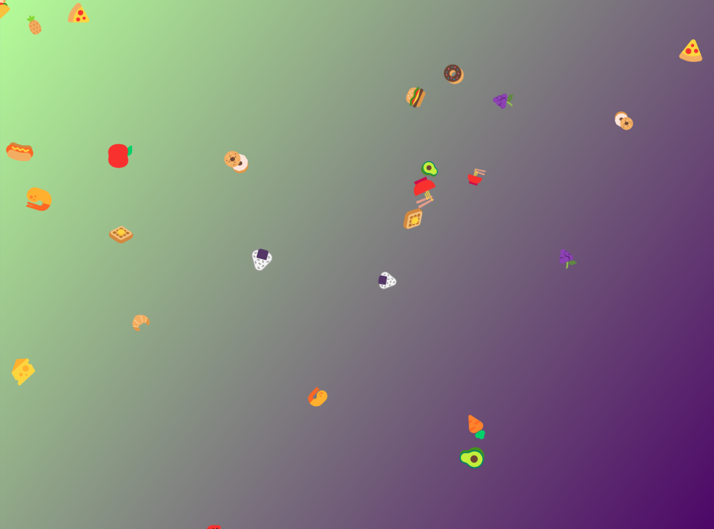

### Starry Night
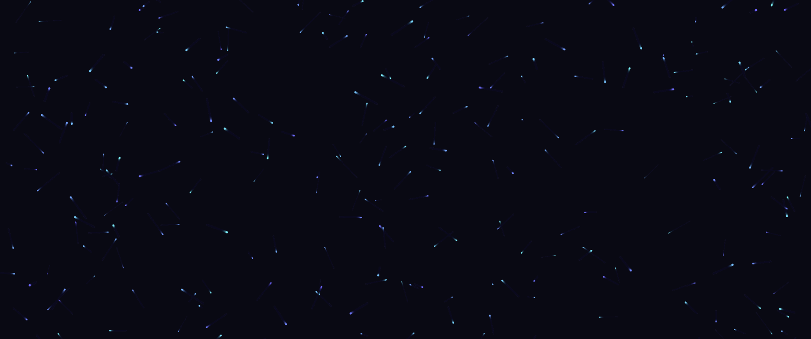

### Floating Bubbles
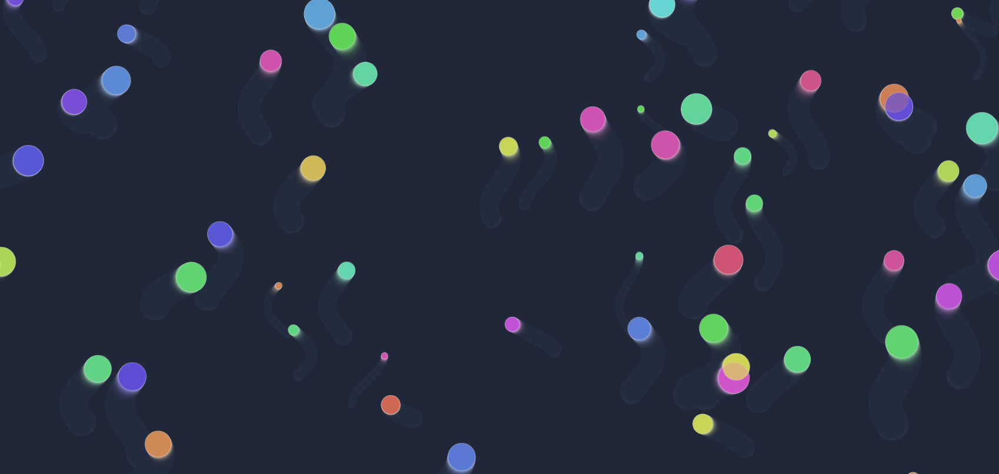

### Gradient Wave


### Particle Network
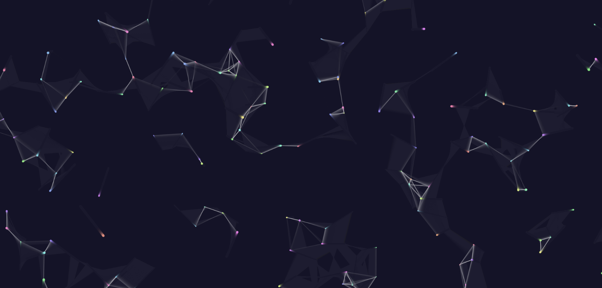

### Galaxy Spiral
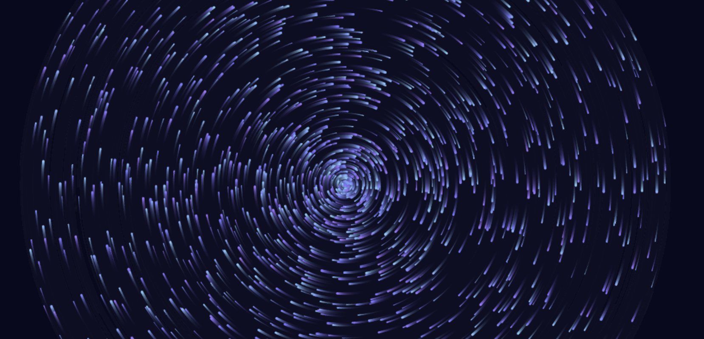

### Rainbow Waves
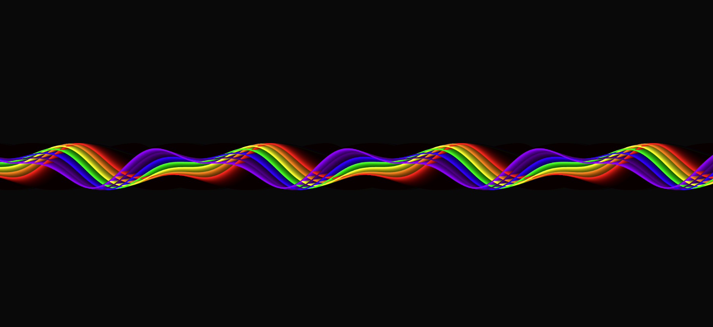

### Geometric Shapes
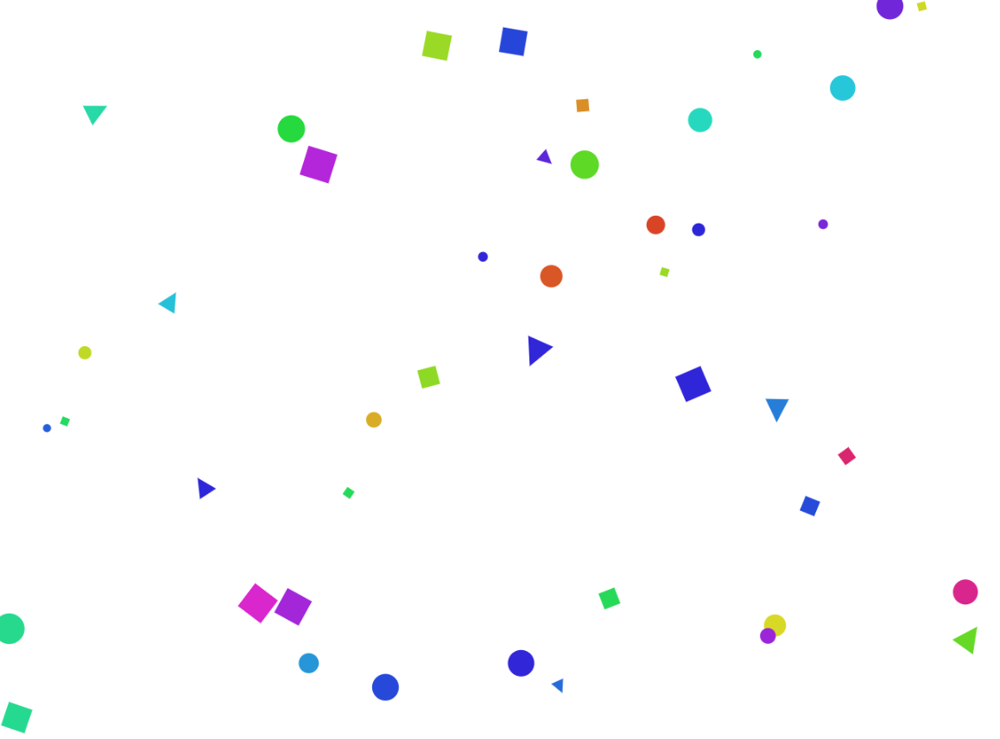

### Fireflies
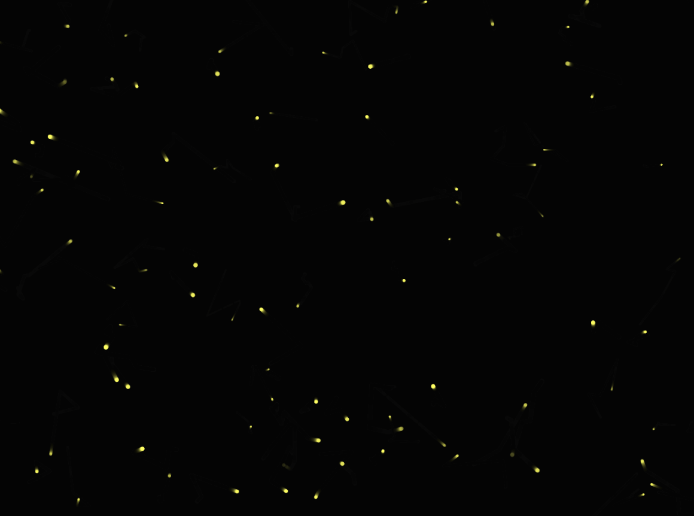

### Matrix Rain
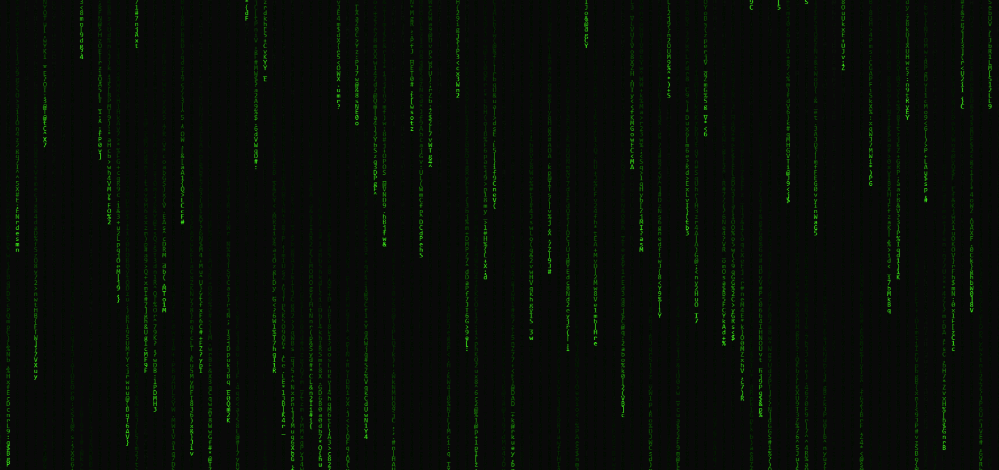

### Quantum Field


### Electric Storm
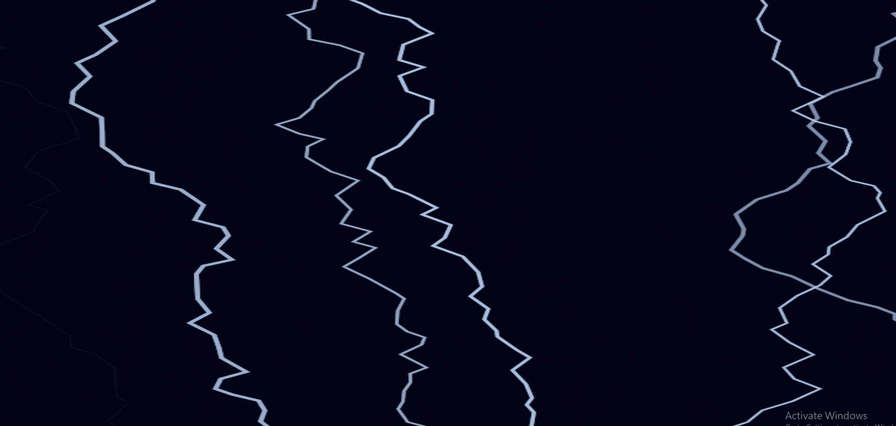

### Cosmic Dust
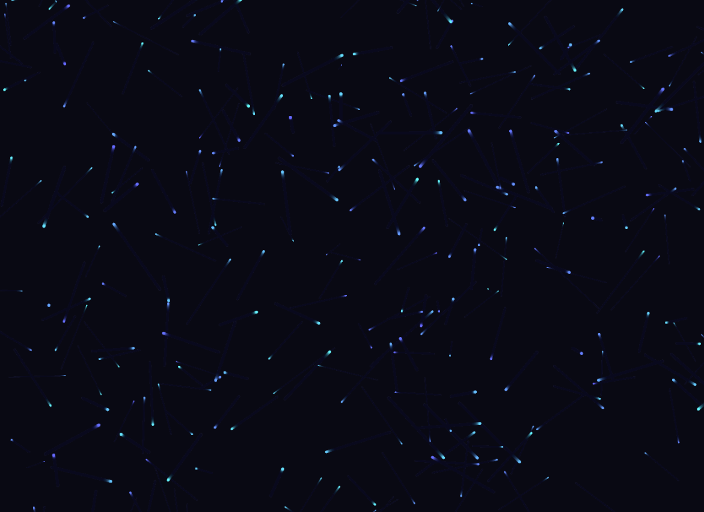

### Neon Pulse
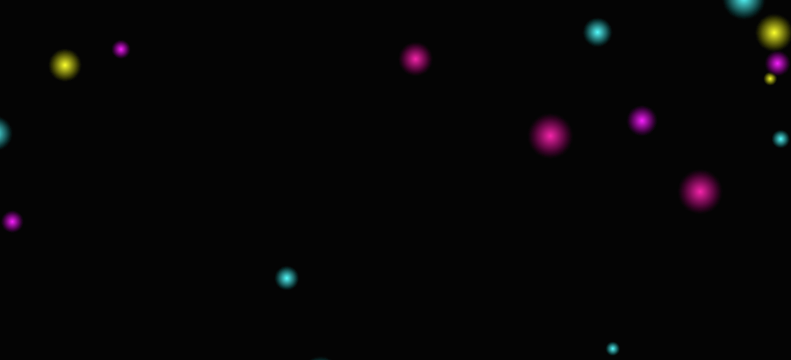

### Aurora Borealis


## Adding New Animations

To add a new animation:

1. Create a new file in the `src` directory of the package, e.g., `newAnimation.js`.
2. Define your animation function. It should accept `canvas` and `ctx` parameters and return a function that updates the animation for each frame.
3. Export your new animation from `src/backgroundAnimations.js`.
4. Update the `animations` object in `src/index.js` to include your new animation.

Example of a new animation:

```javascript
// src/newAnimation.js
export const newAnimation = (canvas, ctx) => {
  // Setup code here

  return () => {
    // Animation update code here
  };
};

// src/backgroundAnimations.js
export { newAnimation } from './newAnimation';

// src/index.js
import { newAnimation } from './backgroundAnimations';

const animations = {
  // ... existing animations
  newAnimation,
};
```

After adding a new animation, rebuild the package with `npm run build`.

## Contributing

Contributions are welcome! Please feel free to submit a Pull Request.

## License

This project is licensed under the MIT License.
