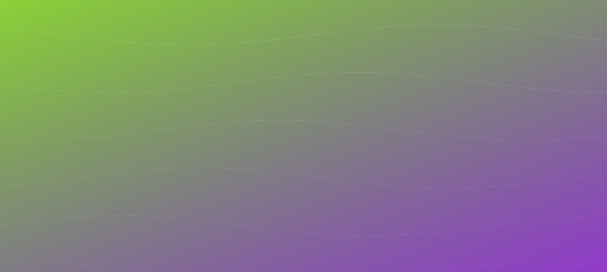

# Animated Backgrounds [](https://socket.dev/npm/package/animated-backgrounds/overview/1.1.0)

[](https://www.npmjs.com/package/animated-backgrounds)
[](https://www.npmjs.com/package/animated-backgrounds?activeTab=dependents)


A React package for easy-to-use, customizable animated backgrounds.
Sample implementation https://qr-generator-murex.vercel.app/
## Docs https://umerfarok.github.io/animated-backgrounds/

## Installation

```bash
npm install animated-backgrounds
```

or

```bash
yarn add animated-backgrounds
```

## Usage

To use the animated backgrounds in your React application, import the `AnimatedBackground` component and use it in your JSX:

```jsx
import React from 'react';
import { AnimatedBackground } from 'animated-backgrounds';

function App() {
  return (
    <div>
      <AnimatedBackground animationName="starryNight" 
       blendMode="screen" />
      {/* Your app content */}
    </div>
  );
}

export default App;
```


## Usage For Animated Text

To use animated text effects in your React application, import the `AnimatedText` component and use it in your JSX:

```jsx
import React from 'react';
import { AnimatedText } from 'animated-backgrounds';

function App() {
  return (
    <div>
      {/* Basic usage */}
      <AnimatedText 
        text="Hello World!"
        effect="typewriter"
      />

      {/* With configuration */}
      <AnimatedText 
        text="Animated Text with Config"
        effect="rainbow"
        config={{
          speed: 100,
          loop: true,
          delay: 1000,
          color: '#ff0000'
        }}
      />

      {/* With custom styles */}
      <AnimatedText 
        text="Custom Styled Text"
        effect="bounce"
        styles={{
          fontSize: '2em',
          fontWeight: 'bold',
          color: '#0066ff'
        }}
      />

      {/* Combined with other components */}
      <h1>
        <AnimatedText 
          text="Welcome to My App"
          effect="glitch"
        />
      </h1>
    </div>
  );
}

export default App;
```

## Usage in Next.js with SSR
When using the AnimatedBackground component in a Next.js project with server-side rendering (SSR), you need to ensure that the component is rendered on the client side. You can do this by adding the "use client" directive at the top of the file where you use the component.

```jsx
// pages/index.js
"use client";

import React from 'react';
import AnimatedBackground from 'animated-backgrounds';

const Home = () => {
  return (
    <div>
      <h1>Welcome to Next.js with Animated Backgrounds</h1>
      <AnimatedBackground animationName="starryNight" 
       blendMode="screen"  // Optional: Add blend mode for visual effects

      />
    </div>
  );
};  

export default Home;
```

## Blend Modes

The package supports various blend modes to create different visual effects. Available blend modes include:

- `normal` (default)
- `multiply`
- `screen`
- `overlay`
- `darken`
- `lighten`
- `color-dodge`
- `color-burn`
- `hard-light`
- `soft-light`
- `difference`
- `exclusion`
- `hue`
- `saturation`
- `color`
- `luminosity`

To use a blend mode, simply set the `blendMode` prop on the `AnimatedBackground` component:

```jsx
<AnimatedBackground 
  animationName="starryNight" 
  blendMode="screen" 
/>
```

## Recommended Blend Modes for Specific Effects

- **Screen**: Use for light effects and glowing animations.
- **Multiply**: Use for darker, atmospheric effects.
- **Overlay**: Use for increased contrast and vibrant colors.
- **Color-Dodge**: Use for intense light effects.

## Available Animations

The package currently includes the following animations:

- `starryNight`
- `floatingBubbles`
- `gradientWave`
- `particleNetwork`
- `galaxySpiral`
- `rainbowWaves`
- `geometricShapes`
- `fireflies`
- `matrixRain`
- `quantumField`
- `electricStorm`
- `cosmicDust`, `neonPulse`, `auroraBorealis`, `autumnLeaves`, `dnaHelix`, `fallingFoodFiesta`


To use a different animation, simply change the `animationName` prop:

```jsx

<AnimatedBackground animationName="floatingBubbles" />
```

## Cycling Through Backgrounds

If you want to cycle through different backgrounds on each page reload, you can use the following approach:

```jsx
import React, { useState, useEffect } from 'react';
import { AnimatedBackground } from 'animated-backgrounds';

function App() {
  const [animation, setAnimation] = useState({
    name: 'starryNight',
    blendMode: 'normal'
  });

  useEffect(() => {
    const animations = ['starryNight', 'floatingBubbles', 'gradientWave'];
    const blendModes = ['screen', 'multiply', 'overlay', 'color-dodge'];
    
    const storedIndex = localStorage.getItem('backgroundAnimationIndex');
    const storedBlendIndex = localStorage.getItem('blendModeIndex');
    
    const newIndex = storedIndex ? (parseInt(storedIndex) + 1) % animations.length : 0;
    const newBlendIndex = storedBlendIndex ? (parseInt(storedBlendIndex) + 1) % blendModes.length : 0;
    
    setAnimation({
      name: animations[newIndex],
      blendMode: blendModes[newBlendIndex]
    });
    
    localStorage.setItem('backgroundAnimationIndex', newIndex.toString());
    localStorage.setItem('blendModeIndex', newBlendIndex.toString());
  }, []);

  return (
    <div>
      <AnimatedBackground 
        animationName={animation.name}
        blendMode={animation.blendMode}
      />
      {/* Your app content */}
    </div>
  );
}

export default App;
```

This code will cycle through all available animations, changing to a new one each time the page is reloaded.

## Customization

The `AnimatedBackground` component accepts additional props for customization:

```jsx
<AnimatedBackground 
  animationName="starryNight"
  style={{ opacity: 0.5 }}  // Add any additional CSS styles
/>
```

## Animations we have
### Falling Food Fiesta


### Starry Night


### Floating Bubbles


### Gradient Wave


### Particle Network


### Galaxy Spiral


### Rainbow Waves


### Geometric Shapes


### Fireflies


### Matrix Rain


### Quantum Field


### Electric Storm


### Cosmic Dust


### Neon Pulse


### Aurora Borealis


## Adding New Animations

To add a new animation:

1. Create a new file in the `src` directory of the package, e.g., `newAnimation.js`.
2. Define your animation function. It should accept `canvas` and `ctx` parameters and return a function that updates the animation for each frame.
3. Export your new animation from `src/backgroundAnimations.js`.
4. Update the `animations` object in `src/index.js` to include your new animation.

Example of a new animation:

```javascript
// src/newAnimation.js
export const newAnimation = (canvas, ctx) => {
  // Setup code here

  return () => {
    // Animation update code here
  };
};

// src/backgroundAnimations.js
export { newAnimation } from './newAnimation';

// src/index.js
import { newAnimation } from './backgroundAnimations';

const animations = {
  // ... existing animations
  newAnimation,
};
```

After adding a new animation, rebuild the package with `npm run build`.

## Contributing

Contributions are welcome! Please feel free to submit a Pull Request.

## License

This project is licensed under the MIT License.
